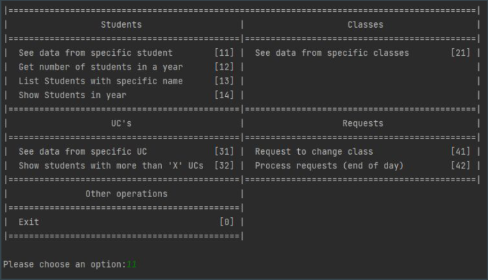
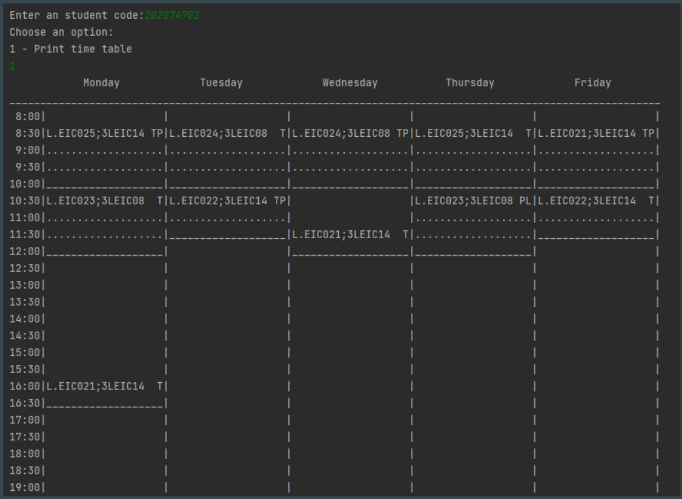
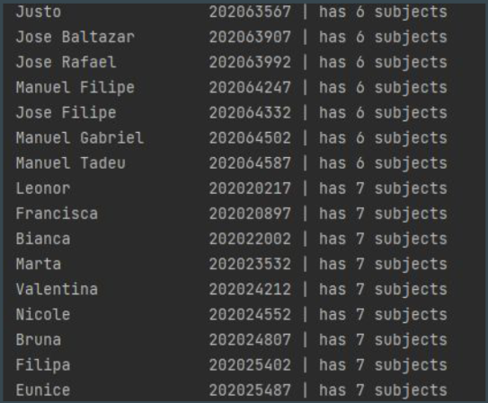

# Algorithms and Data Structures

Develop a system capable of helping in FEUP’s timetable management system (visualizing and changing).

## Setup

You need to move `.csv` files from `data` folder to `cmake-build-debug`

## Execution examples:

 <pre>                                   MENU      </pre>       

&nbsp;
 <pre>                                   SCHEDULE      </pre>       

&nbsp;
 <pre>                                   LIST OF STUDENTS      </pre>       

&nbsp;

Grade 19.98 / 20